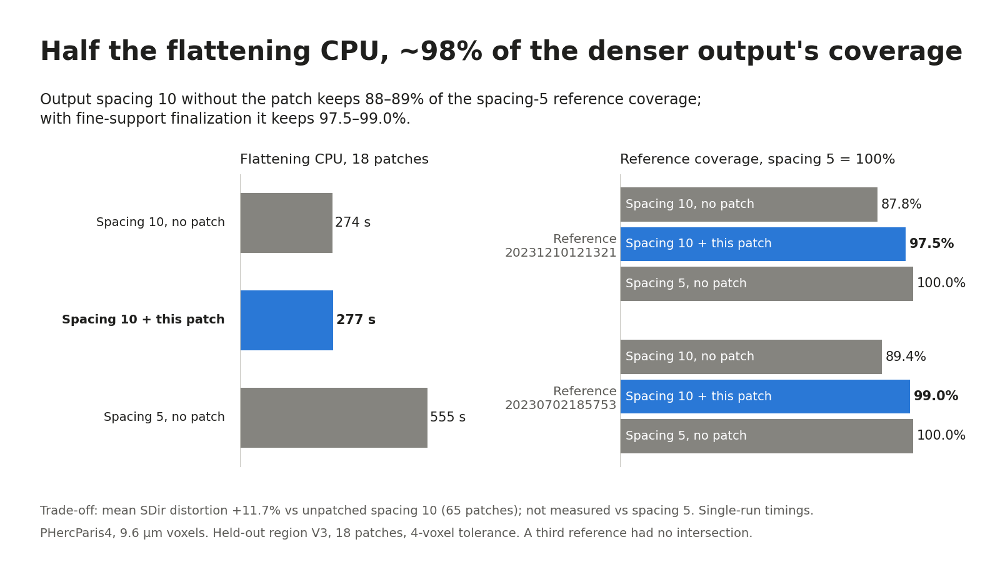

# ink-surface-support

An optional final-mask rule for Villa's
[`spiral-fitting/grow_track_graph.py`](https://github.com/ScrollPrize/villa/blob/fb8c2c4c2705746eefb42e9bb359560906f391e2/spiral-fitting/grow_track_graph.py):
`--coarse-mask-mode support`. Proposed upstream in
[ScrollPrize/villa#1996](https://github.com/ScrollPrize/villa/pull/1996).

With it, a surface written at output spacing 10 reaches almost the same
registered-reference coverage as one written at spacing 5, at half the
flattening CPU. In the held-out test region, spacing 10 without the patch keeps
88–89% of the spacing-5 coverage; with the patch it keeps 97.5–99.0%. The price
is higher flattening distortion.



## What it changes

The grower builds a surface on a working grid, cleans it, resamples it to the
output grid and writes a TIFXYZ patch. At the end it erodes the resampled valid
mask by one cell everywhere. The patch replaces only that step:

```text
upstream (default, --coarse-mask-mode erode)
  tracks + crossings -> grow -> clean working grid -> resample to output grid
                     -> erode valid mask by 1 cell -> largest component -> TIFXYZ

this patch (--coarse-mask-mode support)
  tracks + crossings -> grow -> clean working grid -> resample to output grid
                     -> keep each output quad that the cleaned working grid
                        supports; no blanket erosion
                     -> largest component -> TIFXYZ
```

Growth, cleaning, area gates, the TIFXYZ format and the official Lasagna
flatten are all upstream code. Uniform erosion stays the default.

## Why not just lower `--output-spacing`?

You can: spacing 5 covers more of the reference than spacing 10. But it
doubles the flattening CPU (555 s vs 274 s here). At spacing 10 the final
erosion trims a full 10-voxel cell along every edge, and that is where most of
the gap comes from: skipping it recovers 79–91% of the difference.

An early run at the upstream default spacing 20 also kept more area with the
patch, but plain spacing 10 still beat patched spacing 20. So the patch does
not replace choosing a finer spacing; it makes the spacing you chose keep more
of the surface.

## Results

PHercParis4, 9.6 µm voxels, working grid 5 voxels. 96 attempts per arm across
three regions, failures kept; 65 accepted per arm; 195 flattened outputs. The
table shows the held-out region (V3, 18 patches) at a 4-voxel tolerance.

| | Spacing 10, no patch | Spacing 10 + patch | Spacing 5, no patch |
|---|---:|---:|---:|
| Coverage, reference 20231210121321 (mm²) | 9.997 | 11.104 | 11.390 |
| Coverage, reference 20230702185753 (mm²) | 13.926 | 15.428 | 15.585 |
| Share of spacing-5 coverage | 87.8–89.4% | 97.5–99.0% | 100% |
| Flatten CPU, sum of 18 patches (s) | 274.07 | 276.64 | 555.14 |
| Mean SDir distortion on shared source cells (all 3 regions, 65 patches) | baseline | +11.69% | not measured |

- Against unpatched spacing 10, coverage rises by about 11% and the patch
  closes 79–91% of the gap to spacing 5 (65–91% across all five tolerances).
- A small follow-up at spacing 5 vs unpatched 2.5, on two development cases,
  closed 91.81% and 96.21% of the gap, with SDir +7.56% and +13.57%.

All tolerances, regions and per-case data: [docs/RESULTS.md](docs/RESULTS.md).

## Limitations

- Distortion goes up: SDir +11.69% on the same source cells, higher in all 65
  patches (+13.6% in the test region).
- More output area lies where no reference can check it (unknown/outside area grows).
- Acceptance rate is unchanged (65 of 96 per arm).
- One scan and three regions; in the test region two references intersect the
  output and the third does not.
- Timings are single runs.
- Being close to a reference is not proof of the right papyrus layer, and this
  is not a text-recovery result.

## Install and use

Python 3.11 or newer. The installer uses only the standard library. It checks
that `grow_track_graph.py` is the pinned upstream file (Villa
[`fb8c2c4`](https://github.com/ScrollPrize/villa/tree/fb8c2c4c2705746eefb42e9bb359560906f391e2))
and refuses anything else.

```sh
python tools/install_patch.py --checkout /path/to/villa --resample-spacing 5 --output-spacing 10 --check
python tools/install_patch.py --checkout /path/to/villa --resample-spacing 5 --output-spacing 10 --apply
python tools/install_patch.py --checkout /path/to/villa --restore   # undo
```

Then run the grower as usual with the new flag:

```sh
python spiral-fitting/grow_track_graph.py TRACKS.vctracks CROSSINGS.npz OUT_DIR \
  --random-count 1 --workers 1 --resample-spacing 5 --output-spacing 10 \
  --coarse-mask-mode support
```

Supported pairs are working spacing 5 with output spacing 10 or 5 (install
with `--output-spacing 5` for the latter). Flatten the output with the official
Lasagna flatten; [docs/REPRODUCE.md](docs/REPRODUCE.md) has a wrapper for the
exact recipe used here.

In the default `erode` mode the patched grower writes byte-identical surface
grids; `meta.json` gains two record fields (`coarse_mask_mode`,
`coarse_support_certificate`).

## Verify

```sh
pip install -r requirements-test.txt
python -m unittest discover -s tests     # installer, flatten wrapper, spacing-5 checks
python reproduction/rebuild.py --check   # rebuild every table in results/ from evidence.json
```

`rebuild.py` needs only the standard library (Python 3.9+). For figures:
`pip install -r requirements-figures.txt`, then
`python reproduction/render_figures.py --check`. Rerunning the experiment
itself needs the scan data and a Lasagna environment; see
[docs/REPRODUCE.md](docs/REPRODUCE.md).

## License and data

Code is MIT ([LICENSE](LICENSE)). Bundled upstream code from Villa and
spiralcheck keeps its own MIT notices ([THIRD_PARTY_NOTICES.md](THIRD_PARTY_NOTICES.md)).
The MIT license covers code only. Scan data comes from the
[Vesuvius Challenge data portal](https://scrollprize.org/data), which is
CC BY-NC 4.0 unless an asset says otherwise; files on the older server
`dl.ash2txt.org` fall under that server's own agreement. This repository
contains no CT voxels, surface coordinates or images, only aggregate statistics
and file identifiers.
